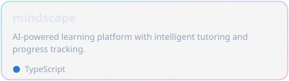
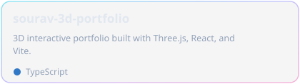
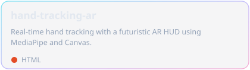
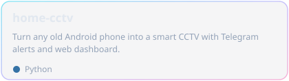
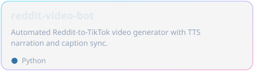
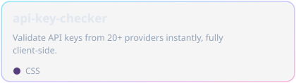

  

  

  
  
  
  
  

  

---

### About Me

I like building real things - AI-powered apps, automation tools, and interactive visualizations - and shipping them end to end.

- Building **Academia**, a full-stack learning platform (Express + Prisma + Postgres)
- Exploring applied AI: LLM apps, computer vision, automation pipelines
- Developing full-stack web apps with JavaScript/TypeScript and Python
- Contributing to open source, one real fix at a time

---

### Tech Stack

  
  
  
  
  

  
  
  
  
  
  
  

  
  
  
  
  
  
  
  

---

### Featured Projects

<table>
  <tr>
    <td width="50%">
      <h3 align="center">Mindscape</h3>
      

        
      

    </td>
    <td width="50%">
      <h3 align="center">3D Portfolio</h3>
      

        
      

    </td>
  </tr>
  <tr>
    <td width="50%">
      <h3 align="center">Hand Tracking AR</h3>
      

        
      

    </td>
    <td width="50%">
      <h3 align="center">Home CCTV</h3>
      

        
      

    </td>
  </tr>
  <tr>
    <td width="50%">
      <h3 align="center">Reddit Video Bot</h3>
      

        
      

    </td>
    <td width="50%">
      <h3 align="center">API Key Checker</h3>
      

        
      

    </td>
  </tr>
</table>

---

### GitHub Analytics

  <picture>
    <source media="(prefers-color-scheme: dark)" srcset="https://github-profile-summary-cards.vercel.app/api/cards/stats?username=sourav-bwn&amp;theme=tokyonight" />
    
  </picture>
  <picture>
    <source media="(prefers-color-scheme: dark)" srcset="https://github-profile-summary-cards.vercel.app/api/cards/repos-per-language?username=sourav-bwn&amp;theme=tokyonight" />
    
  </picture>

  <picture>
    <source media="(prefers-color-scheme: dark)" srcset="https://streak-stats.demolab.com?user=sourav-bwn&amp;theme=tokyonight&amp;hide_border=true" />
    
  </picture>

  <picture>
    <source media="(prefers-color-scheme: dark)" srcset="https://github-profile-summary-cards.vercel.app/api/cards/profile-details?username=sourav-bwn&amp;theme=tokyonight" />
    
  </picture>

---

### Let's Connect

  
  
  
  

  

  

